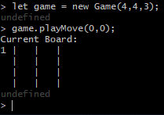
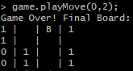
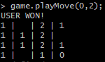
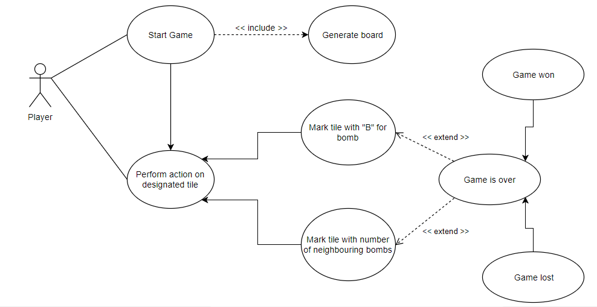
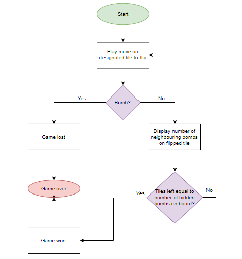
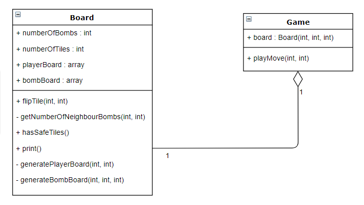

# Pet Project: Minesweeper
This is a simple console output-only game written in vanilla JavaScript. <br />
The idea behind the pet project is to get back into coding and apply a list of topics that have been taught during the lecture of the module **Advanced Softwareengineering**. <br />
The code is an adaption of a project from an intensive program [Build Front-End Web Applications from Scratch](http://pro.codecademy.com/intensive/build-frontend-webapps-from-scratch/ "Codecademy Program Reference") found on Codecademy, in which I participated to learn JavaScript earlier in 2018.

## The Game
The game is a console-only game and the project code can be executed using *node*.
Each game can be initialized with dimensions of the users choice. It can be a small squared 3x3 game board or a
rectangle of any form.

Example: initialize, loose and win the game:  <br />
 <br />
 <br />


### How to play
After you have successfully pulled the project from this repository, open a terminal on your local machine and navigate to the lib directory. Now run the following commands:

To start the game (1-3), to play (4) and to exit (5) the game
1. `node`
2. `.load game.js` (to load the contents of this file)
3. `let game = new Game(3, 3, 3);` (create a Game instance with Game(numberOfRows, numberOfColumns, numberOfBombs))
4. Run commands like so: `game.playMove(0, 1);` and  `game.playMove(1, 2);`
5. `.exit`

## UML Diagrams
The following diagrams are following the UML notation. For this pet project, I produced two *behavioral diagrams* and one *structural diagram*:
### Use case diagram

### Flow chart

### Class diagram


## Metrics
[](https://sonarcloud.io/dashboard?id=binsi_petproject-minesweeper) <br />

In order to analyze many metrics at once, I utilize the [SonarQube Scanner](https://docs.sonarqube.org/display/SCAN/Analyzing+with+SonarQube+Scanner). This is an automatic code review tool to detect bugs, vulnerabilities and code smells in the code. It can integrate with any existing workflow to enable continuous code inspection across all project branches and pull requests. <br />

Sonarcloud: [Click here to go to project dashboard](https://sonarcloud.io/dashboard?id=binsi_petproject-minesweeper "Go to Sonarcloud")

## Clean Code
Clean code development is a coding paradigm that follows a few coding principles. I adjusted my code to fulfill a list of principles taken from a JavaScript-specific clean code repository: https://github.com/ryanmcdermott/clean-code-javascript <br />

This project follows among others the following concepts:
1. [Prefer ES2015/ES6 classes over ES5 plain functions](https://github.com/binsi/petproject-minesweeper/blob/master/src/game.js#L4)
2. [Use consistent capitalization](https://github.com/binsi/petproject-minesweeper/blob/master/src/board.js#L2)
3. Don't leave commented out code in your codebase
4. Avoid positional markers
5. [Use meaningful and pronounceable variable names](https://github.com/binsi/petproject-minesweeper/blob/master/src/board.js#L27)
6. Don't add unneeded context
7. [Function names should say what they do](https://github.com/binsi/petproject-minesweeper/blob/master/src/board.js#L13)
8. [Encapsulate conditionals](https://github.com/binsi/petproject-minesweeper/blob/master/src/board.js#L55)

## Build Management & Continuous Delivery
[](https://travis-ci.com/binsi/petproject-minesweeper) <br />

Travis CI a *continuous integration* platform which supports the development process by automatically building and testing code changes, and providing immediate feedback on the success of the change. <br />

Travis CI: [Click here to go to project dashboard](https://travis-ci.com/binsi/petproject-minesweeper "Go to Travis CI")

## AOP
The idea behind aspect oriented programming is to boil down the lines of code that do not necessarily contribute to the methods purpose, so their readability and maintainability improves. The central purpose of AOP is the separation of concerns (see also *clean code principles*). <br />

An idea on how to implement *AOP* within my pet project's code is hard to come up with as most of the time AOP is helpful when crucial data is fetched and the success should be manifested through logging. <br />

In JavaScript I would use the *aspect.js* library and if my pet project had a class that would contain a method which would rely on fetching the data, then the logging would be separated in another class which does the logging before and/or after the method has been called and executed. <br />

Here is an example [I found](https://medium.com/@kyuwoo.choi/sneak-peek-to-javascript-aop-16458f807842) which shows what I have tried explaining above: <br />

```javascript
class LoggerAspect {
  ...
  @afterMethod({
    methodNamePattern: /^getNameByISBN$/,
    classNamePattern: /^BookCollection$/
  })
  afterGetNameByISBN(meta) {
    let result = meta.method.result;
    Logger.info(`Retrieving ${result.isbn} - ${result.name} has been succeed`);
  }
  ...
}


@Wove
class BookCollection {
  ...
  getNameByISBN(id, article) {
    return this.get({
      isbn: isbn
    }, {
      cache: true,
      onSuccess: 'name'
      onFail: null
    });
  }
  ...
}

```

## DSL
"Domain Specific Languages (DSL) are super useful. They are languages that are focused on solving one specific problem really well, abstracting away details that get in the way of productivity or innovation."(https://medium.com/outsystems-engineering/domain-specific-language-prototyping-and-design-made-easy-9cec69d2d0fc) <br />

An Idea on how to utilize a DSL code snippet in my pet project would be to translate the player's terminal input e.g. `game.playMove(0, 0)` (to flip the next tile) with a shorter command to the input the code can actually resolve as the long version. This would mean, that the player can type in *0,0* and the input that is understood would be translated into *game.playMove(0, 0)*. <br />

I have outlined the idea with a small code snippet which can be found in [src/dsl-userinput.js]().

## Functional Programming
## Logical Solver
## Code Fragment
